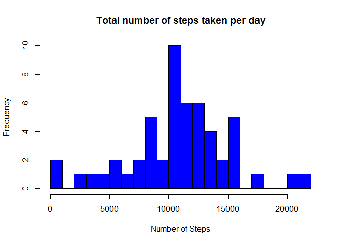
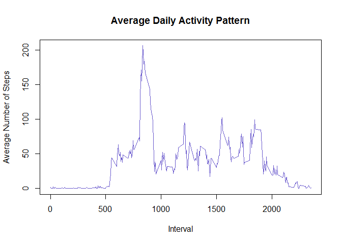
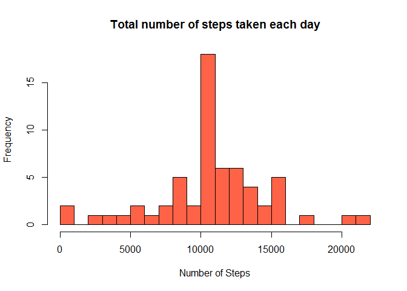

Setting the working directory and loading/viewing the data

    ## Loading and Processing the Data 

    activeData <- read.csv ("activity.csv", header = TRUE, sep = ",", stringsAsFactors = NA)

    ## Checking what the data looks like

    summary(activeData)

    ##      steps                date          interval     
    ##  Min.   :  0.00   2012-10-01:  288   Min.   :   0.0  
    ##  1st Qu.:  0.00   2012-10-02:  288   1st Qu.: 588.8  
    ##  Median :  0.00   2012-10-03:  288   Median :1177.5  
    ##  Mean   : 37.38   2012-10-04:  288   Mean   :1177.5  
    ##  3rd Qu.: 12.00   2012-10-05:  288   3rd Qu.:1766.2  
    ##  Max.   :806.00   2012-10-06:  288   Max.   :2355.0  
    ##  NA's   :2304     (Other)   :15840

    str(activeData)

    ## 'data.frame':    17568 obs. of  3 variables:
    ##  $ steps   : int  NA NA NA NA NA NA NA NA NA NA ...
    ##  $ date    : Factor w/ 61 levels "2012-10-01","2012-10-02",..: 1 1 1 1 1 1 1 1 1 1 ...
    ##  $ interval: int  0 5 10 15 20 25 30 35 40 45 ...

    head(activeData)

    ##   steps       date interval
    ## 1    NA 2012-10-01        0
    ## 2    NA 2012-10-01        5
    ## 3    NA 2012-10-01       10
    ## 4    NA 2012-10-01       15
    ## 5    NA 2012-10-01       20
    ## 6    NA 2012-10-01       25

    ## Modifying the date and interval variables

    activeData$date <- as.Date(activeData$date, format = "%Y-%m-%d")
    activeData$interval <- factor(activeData$interval)

    ## Checking the data set

    head(activeData)

    ##   steps       date interval
    ## 1    NA 2012-10-01        0
    ## 2    NA 2012-10-01        5
    ## 3    NA 2012-10-01       10
    ## 4    NA 2012-10-01       15
    ## 5    NA 2012-10-01       20
    ## 6    NA 2012-10-01       25

Assignment Prompt: What is the total number of steps taken per day?

    ## Creating a data set that ignores NA values

    NA_index <- is.na(as.character(activeData$steps))

    cleanData <- activeData[!NA_index,]

    # Checking clean data set

    head(cleanData)

    ##     steps       date interval
    ## 289     0 2012-10-02        0
    ## 290     0 2012-10-02        5
    ## 291     0 2012-10-02       10
    ## 292     0 2012-10-02       15
    ## 293     0 2012-10-02       20
    ## 294     0 2012-10-02       25

    ## Creating a variable that counts step per day

    steps_per_day <- aggregate(steps ~ date, data = cleanData, sum)

    ## Checking new variable

    head(steps_per_day)

    ##         date steps
    ## 1 2012-10-02   126
    ## 2 2012-10-03 11352
    ## 3 2012-10-04 12116
    ## 4 2012-10-05 13294
    ## 5 2012-10-06 15420
    ## 6 2012-10-07 11015

    ## Explicitly adding names to the columns of new variable

    colnames(steps_per_day) <- c("date", "steps")

    ## Making a histogram of the total number of steps taken each day

    hist(as.numeric(steps_per_day$steps), breaks = 30, col = "blue", 
        
         xlab = "Number of Steps", 
         
         main= "Total number of steps taken per day")

    ## Calculating and reporting the mean and median of the total number of steps taken per day

    mean(steps_per_day$steps)

    ## [1] 10766.19

    median(steps_per_day$steps)

    ## [1] 10765

Assignment prompt: What is the average daily activity pattern?

    ## Creating a variable that calculate the average number of steps taken per day 
    ## across all days

    steps_all <- aggregate(cleanData$steps, by=list(interval=cleanData$interval), FUN=mean)

    ## Explicitly adding names to the columns of new variable

    colnames(steps_all) <- c("interval", "average_steps")

    ## Plotting the average number of steps taken across all days

    plot(as.integer(levels(steps_all$interval)), steps_all$average_steps, type="l",
         xlab = "Interval", ylab = "Average Number of Steps", main = "Average Daily Activity Pattern",  col ="slateblue")

    ## Creating variable for average max total steps

    step_max<- max(steps_all$average_steps)

    ## checking step_max

    step_max

    ## [1] 206.1698

    # Calulating the 5-minute interval that contains the maximum number of steps

    steps_max_interval<-steps_all[which.max(steps_all$average_steps),]$interval

    ## Checking the max 5 minute interval

    steps_max_interval

    ## [1] 835
    ## 288 Levels: 0 5 10 15 20 25 30 35 40 45 50 55 100 105 110 115 120 ... 2355

    ## Assignment prompt: Which 5-minute interval, on average across all the days in the dataset, 
    ##                    contains the maximum number of steps?

    ## Response: interval 835 with the maximum amount of steps being 206.1698 or 206

Assignment prompt: Imputing missing values; Calculate and report the
total number of missing values in the dataset (i.e. the total number of
rows with NAs)

    sum(is.na(as.character(activeData$steps)))

    ## [1] 2304

    sum(is.na(as.character(activeData$date)))

    ## [1] 0

    sum(is.na(as.character(activeData$interval)))

    ## [1] 0

    ## only the steps column has missing data with 2304 missing observations

    ## Creating new data set with missing values replaced by the mean for the 5 minute interval

    NA_index <- which(is.na(as.character(activeData$steps)))

    data_final <- activeData

    ## Replace the NA values with the mean for the 5 minute interval data

    data_final[NA_index, ]$steps<-unlist(lapply(NA_index, FUN=function(NA_index){
      
      steps_all[activeData[NA_index,]$interval==steps_all$interval,]$average_steps
      
    }))

    # Checking data_final

    summary(data_final)

    ##      steps             date               interval    
    ##  Min.   :  0.00   Min.   :2012-10-01   0      :   61  
    ##  1st Qu.:  0.00   1st Qu.:2012-10-16   5      :   61  
    ##  Median :  0.00   Median :2012-10-31   10     :   61  
    ##  Mean   : 37.38   Mean   :2012-10-31   15     :   61  
    ##  3rd Qu.: 27.00   3rd Qu.:2012-11-15   20     :   61  
    ##  Max.   :806.00   Max.   :2012-11-30   25     :   61  
    ##                                        (Other):17202

    ## Making a histogram of the total number of steps taken each day and Calculating and 
    ## reporting the mean and median total number of steps taken per day. 

    #Creating a varable with the steps taken for each day

    steps_each_day_final <- aggregate(steps ~ date, data = data_final, sum)

    ## Explicitly adding names to the columns of new variable

    colnames(steps_each_day_final) <- c("date", "steps")

    ## Creating the Histogram with imputed values 

    hist(as.numeric(steps_each_day_final$steps), breaks = 20, col = "tomato", 
         
         xlab = "Number of Steps", main= "Total number of steps taken each day")

    ## Calulating the mean and median

    mean(steps_each_day_final$steps)

    ## [1] 10766.19

    median(steps_each_day_final$steps)

    ## [1] 10766.19

    ## There is almost no difference in mean and median when we input values to replace the NA values.
    ## The mean is the same and the median is off by one step

Assignment prompt: Are there differences in activity patterns between
weekdays and weekends?

    ## Creating a day variable

    data_final$day <- as.factor(weekdays(data_final$date))

    ## Creating a weekday variable

    data_final$is_weekday <- ifelse(!(data_final$day %in% c("Saturday","Sunday")), TRUE, FALSE) 

    ## Calculating the average number of steps for weekdays

    data_weekdays <- data_final[data_final$is_weekday,]

    steps_per_interval_weekdays <- aggregate(data_weekdays$steps, by=list(interval=data_weekdays$interval), FUN=mean)

    ## Calculating the average number of steps for weekends

    data_weekends <- data_final[!data_final$is_weekday,]

    steps_per_interval_weekends <- aggregate(data_weekends$steps, by=list(interval=data_weekends$interval), FUN=mean)

    ## Explicitly adding column names

    colnames(steps_per_interval_weekdays) <- c("interval", "average_steps")

    colnames(steps_per_interval_weekends) <- c("interval", "average_steps")

    ## Adding new column for specific days

    steps_per_interval_weekdays$day <- "Weekday"

    steps_per_interval_weekends$day <- "Weekend"

    ## Creating final week variable

    data_week_final <- rbind(steps_per_interval_weekends, steps_per_interval_weekdays)

    ## making the final day varable

    data_week_final $day <- as.factor(data_week_final $day)

    ## Creating the plot

    library(lattice)

    xyplot(average_steps ~  interval | day, data = data_week_final , layout = c(1,2), type ="l", ylab="Number of Steps")

